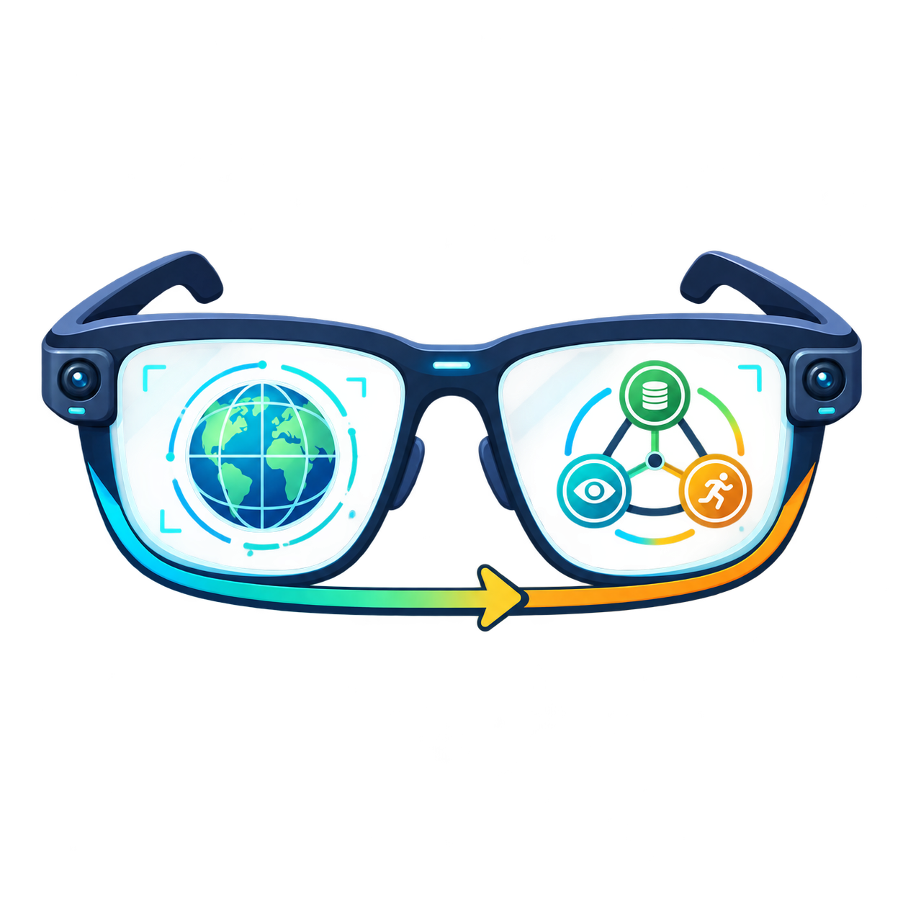
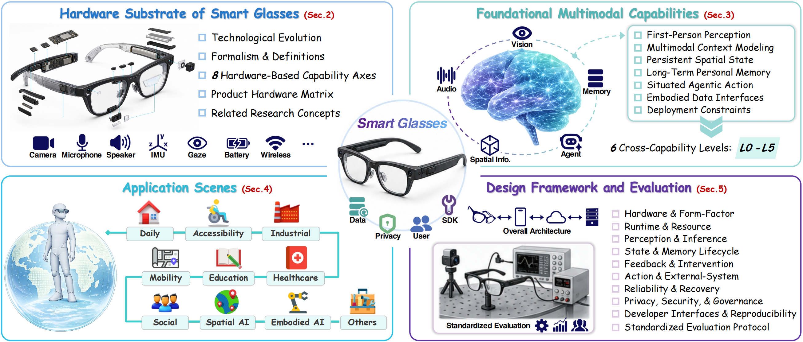
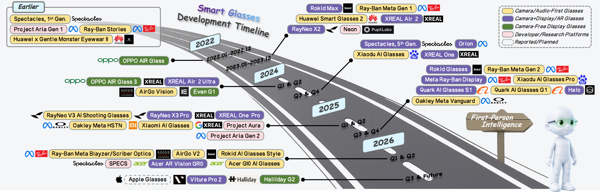
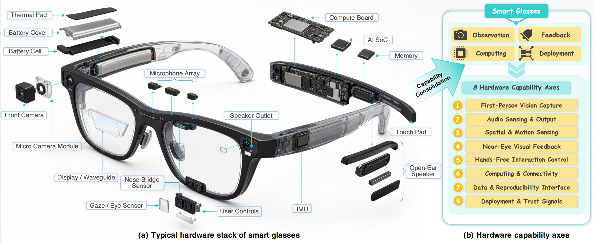
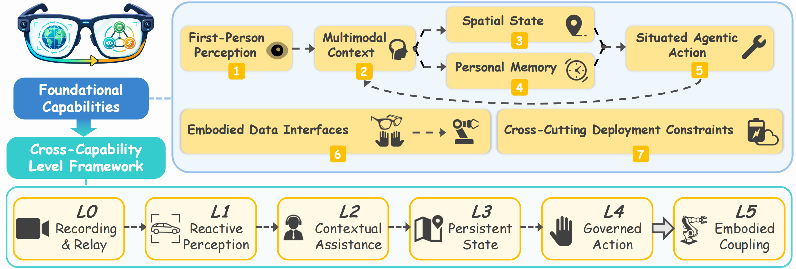

<div align="center">
  <h1 style="display: inline-flex; align-items: center;">
    
    From Seeing to Acting: Smart Glasses as First-Person Intelligence Platforms
  </h1>
</div>

<p align="center">
  <a href="https://github.com/sindresorhus/awesome"></a>
  <a href="LICENSE"></a>
  <a href="https://arxiv.org/abs/2608.24877"></a>
  <a href="https://huggingface.co/papers/2608.24877"></a>
  <a href="#-contributing"></a>
  <a href="assets/imgs/wechat-group.jpg"></a>
</p>

<p align="center">
  <a href="https://zhangzjn.github.io/">Jiangning Zhang</a> <sup>1,*,<a href="mailto:186368@zju.edu.cn">✉</a></sup>&nbsp;,&nbsp;
  <a href="">Haojun Chen</a> <sup>1,*</sup>&nbsp;,&nbsp;
  <a href="https://person.zju.edu.cn/yongliu">Yong Liu</a> <sup>1</sup>
</p>

<p align="center">
    <sup>1</sup>Zhejiang University, APRIL Lab
</p>

This repository accompanies our survey **From Seeing to Acting: Smart Glasses as First-Person Intelligence Platforms** and maintains a structured collection of smart-glasses products/platforms, foundational capabilities, and application scenarios, which will be continuously updated.For more details, kindly refer to our [paper](https://arxiv.org/abs/2608.24877) 🚀

💬 Researchers and industry practitioners are welcome to join our [WeChat group](assets/imgs/wechat-group.jpg); we look forward to exchanging ideas and collaborating with you.

<p align="center">
  
</p>

## 📰 News

<!-- News will be updated here. -->
- **2026-08-26**: We release our initial-version survey: [From Seeing to Acting: Smart Glasses as First-Person Intelligence Platforms](https://arxiv.org/abs/2608.24877).

## Table of Contents

- [🎯 Contributions](#contributions)
- [👓 Representative Smart-Glasses Products/Platforms](#representative-smart-glasses-productsplatforms)
- [📏 Foundational Capabilities for Smart Glasses](#foundational-capabilities-for-smart-glasses)
- [🌍 Application Scenes for Smart Glasses](#application-scenes-for-smart-glasses)
  - [4.1 Daily Situated Assistance](#41-daily-situated-assistance)
  - [4.2 Accessibility Assistance](#42-accessibility-assistance)
  - [4.3 Industrial Workflow Support](#43-industrial-workflow-support)
  - [4.4 Healthcare and Caregiving](#44-healthcare-and-caregiving)
  - [4.5 Education and Skills Training](#45-education-and-skills-training)
  - [4.6 Mobility and Transportation Safety](#46-mobility-and-transportation-safety)
  - [4.7 Social Interaction and Collaboration](#47-social-interaction-and-collaboration)
  - [4.8 Spatial Intelligence](#48-spatial-intelligence)
  - [4.9 Embodied Intelligence](#49-embodied-intelligence)
- [📄 Citation](#-citation)
- [🤝 Contributing](#-contributing)
- [🔗 Related Resources & Links](#-related-resources--links)
- [🤗 Acknowledgments](#acknowledgments)

## 🎯 Contributions

<details>
<summary><strong>1️⃣ A formal and hardware-grounded problem definition.</strong></summary>

We define smart glasses through a first-person observation stream, a closed-loop mapping from observation and intent to feedback, persistent state, and optional action, and a constrained utility objective that makes latency, energy, thermals, privacy, and social cost explicit. We further consolidate heterogeneous devices into eight verifiable hardware capability axes and route-aware product profiles, converting marketing categories into evidence-bearing experimental substrates.

</details>

<details>
<summary><strong>2️⃣ A compositional capability framework with explicit evidential boundaries.</strong></summary>

We synthesize seven interdependent capabilities: first-person perception, multimodal context, persistent spatial state, auditable personal memory, situated agentic action, embodied data interfaces, and cross-cutting deployment constraints. Building upon these building blocks, we present an L0-L5 framework that covers capture, reactive perception, contextual assistance, persistent state, governed action, and embodied coupling. The framework treats levels as task- and evidence-conditioned claims, distinguishes prerequisites from demonstrated capability, and makes clear that L5 crosses the embodiment boundary rather than simply extending the wearer-facing L0-L4 axis.

</details>

<details>
<summary><strong>3️⃣ An application-centered evidence map.</strong></summary>

We reorganize the literature into nine application scenes and connect each scene to its required capability loop, representative datasets and benchmarks, research systems, product entry points, affected stakeholders, failure consequences, and missing validation evidence. This structure separates transferable component evidence from direct smart-glasses evidence and clarifies why identical model functions require different thresholds in daily assistance, accessibility, industry, healthcare, education, mobility, social collaboration, spatial intelligence, and embodied intelligence.

</details>

<details>
<summary><strong>4️⃣ A deployment and evaluation blueprint.</strong></summary>

We formulate nine coupled design dimensions covering hardware, runtime, perception and inference, memory, feedback, external action, reliability, governance, and reproducibility. On this basis, we provide a claim-conditioned evaluation protocol, a deployment checklist, and an iterative evidence ladder that connects documentation, laboratory measurement, benchmark testing, device-stream replay, fault injection, end-to-end studies, longitudinal deployment, and privacy or security audit. We finally derive eight open challenges and six roadmap directions for building trustworthy first-person embodied-intelligence systems.

</details>

## Representative Smart-Glasses Products/Platforms

<p align="center">
  
</p>

<details>
<summary><strong>Figure: Hardware stack and hardware-based capability-axis consolidation. </strong></summary>

<p align="center">
  
</p>

</details>

## Foundational Capabilities for Smart Glasses

<details>
<summary><strong>Figure: Foundational capabilities and L0-L5 cross-capability level framework. </strong></summary>

<p align="center">
  
</p>

</details>

> ⏰ We organize the works in chronological order, from the earliest to the latest.
🎨 Colored labels indicate <strong>seven foundational capabilities</strong> to which the work contributes: , , , , , , and .

| Capabilities | Paper Title | Link |
|---|---|---|
|  | The AMI Meeting Corpus: A Pre-Announcement | [](https://link.springer.com/chapter/10.1007/11677482_3) |
|  | In Situ with Bystanders of Augmented Reality Glasses: Perspectives on Recording and Privacy-Mediating Technologies | [](https://dl.acm.org/doi/10.1145/2556288.2557352) |
|  | NavCog: A Navigational Cognitive Assistant for the Blind | [](https://dl.acm.org/doi/10.1145/2935334.2935361) |
|  | ScanNet: Richly-Annotated 3D Reconstructions of Indoor Scenes | [](https://arxiv.org/abs/1702.04405) |
|  | VINS-Mono: A Robust and Versatile Monocular Visual-Inertial State Estimator | [](https://arxiv.org/abs/1708.03852) |
|  | Matterport3D: Learning from RGB-D Data in Indoor Environments | [](https://arxiv.org/abs/1709.06158) |
| <br> | VizWiz Grand Challenge: Answering Visual Questions from Blind People | [](https://arxiv.org/abs/1802.08218) |
|  | Your Smart Glasses' Camera Bothers Me! Exploring Opt-In and Opt-Out Gestures for Privacy Mediation | [](https://dl.acm.org/doi/10.1145/3240167.3240174) |
|  | AVA Active Speaker: An Audio-Visual Dataset for Active Speaker Detection | [](https://arxiv.org/abs/1901.01342) |
|  | COIN: A Large-Scale Dataset for Comprehensive Instructional Video Analysis | [](https://arxiv.org/abs/1903.02874) |
|  | Evaluating a Wearable Camera's Social Acceptability In-the-Wild | [](https://dl.acm.org/doi/10.1145/3290607.3312837) |
| <br> | In the Eye of the Beholder: Joint Learning of Gaze and Actions in First Person Video | [](https://arxiv.org/abs/2006.00626) |
| <br> | Rescaling Egocentric Vision: Collection, Pipeline and Challenges for EPIC-KITCHENS-100 | [](https://arxiv.org/abs/2006.13256) |
| <br> | The IKEA ASM Dataset: Understanding People Assembling Furniture through Actions, Objects and Pose | [](https://arxiv.org/abs/2007.00394) |
|  | QMSum: A New Benchmark for Query-Based Multi-Domain Meeting Summarization | [](https://arxiv.org/abs/2104.05938) |
|  | DROID-SLAM: Deep Visual SLAM for Monocular, Stereo, and RGB-D Cameras | [](https://arxiv.org/abs/2108.10869) |
| <br> | Ego4D: Around the World in 3,000 Hours of Egocentric Video | [](https://arxiv.org/abs/2110.07058) |
| <br> | Assembly101: A Large-Scale Multi-View Video Dataset for Understanding Procedural Activities | [](https://arxiv.org/abs/2203.14712) |
|  | LidSonic for Visually Impaired: Green Machine Learning-Based Assistive Smart Glasses with Smart App and Arduino | [](https://www.researchgate.net/publication/359596956_LidSonic_for_Visually_Impaired_Green_Machine_Learning-Based_Assistive_Smart_Glasses_with_Smart_App_and_Arduino) |
| <br> | EgoTracks: A Long-Term Egocentric Visual Object Tracking Dataset | [](https://arxiv.org/abs/2301.03213) |
| <br> | EPIC-Sounds: A Large-Scale Dataset of Actions That Sound | [](https://arxiv.org/abs/2302.00646) |
| <br> | Aria Digital Twin: A New Benchmark Dataset for Egocentric 3D Machine Perception | [](https://arxiv.org/abs/2306.06362) |
|  | EgoVLPv2: Egocentric Video-Language Pre-Training with Fusion in the Backbone | [](https://arxiv.org/abs/2307.05463) |
| <br><br><br><br> | Project Aria: A New Tool for Egocentric Multi-Modal AI Research | [](https://arxiv.org/abs/2308.13561) |
|  | EgoObjects: A Large-Scale Egocentric Dataset for Fine-Grained Object Understanding | [](https://arxiv.org/abs/2309.08816) |
| <br><br><br> | HoloAssist: An Egocentric Human Interaction Dataset for Interactive AI Assistants in the Real World | [](https://arxiv.org/abs/2309.17024) |
|  | Head-Mounted Display Augmented Reality in Manufacturing: A Systematic Review | [](https://dl.acm.org/doi/10.1016/j.rcim.2023.102567) |
|  | Ego-Exo4D: Understanding Skilled Human Activity from First- and Third-Person Perspectives | [](https://arxiv.org/abs/2311.18259) |
|  | Memoro: Using Large Language Models to Realize a Concise Interface for Real-Time Memory Augmentation | [](https://arxiv.org/abs/2403.02135) |
| <br><br><br> | OpenEQA: Embodied Question Answering in the Era of Foundation Models | [](https://ieeexplore.ieee.org/document/10654928) |
|  | EgoMimic: Scaling Imitation Learning via Egocentric Video | [](https://arxiv.org/abs/2410.24221) |
| <br><br> | Vinci: A Real-Time Smart Assistant Based on Egocentric Vision-Language Model for Portable Devices | [](https://arxiv.org/abs/2412.21080) |
| <br> | EgoLife: Towards Egocentric Life Assistant | [](https://arxiv.org/abs/2503.03803) |
|  | EgoDex: Learning Dexterous Manipulation from Large-Scale Egocentric Video | [](https://arxiv.org/abs/2505.11709) |
| <br> | ContextAgent: Context-Aware Proactive LLM Agents with Open-World Sensory Perceptions | [](https://arxiv.org/abs/2505.14668) |
| <br> | EgoZero: Robot Learning from Smart Glasses | [](https://arxiv.org/abs/2505.20290) |
|  | AdaVideoRAG: Omni-Contextual Adaptive Retrieval-Augmented Efficient Long Video Understanding | [](https://arxiv.org/abs/2506.13589) |
|  | EgoVLA: Learning Vision-Language-Action Models from Egocentric Human Videos | [](https://arxiv.org/abs/2507.12440) |
| <br> | EgoTrigger: Toward Audio-Driven Image Capture for Human Memory Enhancement in All-Day Energy-Efficient Smart Glasses | [](https://arxiv.org/abs/2508.01915) |
|  | AI for Service: Proactive Assistance with AI Glasses | [](https://arxiv.org/abs/2510.14359) |
|  | EgoMI: Learning Active Vision and Whole-Body Manipulation from Egocentric Human Demonstrations | [](https://arxiv.org/abs/2511.00153) |
| <br><br> | WearVQA: A Visual Question Answering Benchmark for Wearables in Egocentric Authentic Real-World Scenarios | [](https://arxiv.org/abs/2511.22154) |
| <br> | ROMA: Real-time Omni-Multimodal Assistant with Interactive Streaming Understanding | [](https://arxiv.org/abs/2601.10323) |
|  | Agentic Very Long Video Understanding | [](https://arxiv.org/abs/2601.18157) |
| <br> | VisGuardian: A Lightweight Group-based Privacy Control Technique For Front Camera Data From AR Glasses in Home Environments | [](https://arxiv.org/abs/2601.19502) |
| <br> | Evaluating OCR Performance for Assistive Technology: Effects of Walking Speed, Camera Placement, and Camera Type | [](https://arxiv.org/abs/2602.02223) |
| <br><br> | LEVIO: Lightweight Embedded Visual Inertial Odometry for Resource-Constrained Devices | [](https://arxiv.org/abs/2602.03294) |
| <br><br> | GLIMPSE: Real-Time Text Recognition and Contextual Understanding for VQA in Wearables | [](https://arxiv.org/abs/2602.13479) |
| <br><br> | SAW-Bench: Learning Situated Awareness in the Real World | [](https://arxiv.org/abs/2602.16682) |
| <br> | Conversational Successes and Breakdowns in Everyday Smart Glasses Use | [](https://arxiv.org/abs/2602.22340) |
| <br> | Exploring Multimodal LMMs for Online Episodic Memory Question Answering on the Edge | [](https://arxiv.org/abs/2602.22455) |
| <br><br> | SUPERGLASSES: Benchmarking Vision Language Models as Intelligent Agents for AI Smart Glasses | [](https://arxiv.org/abs/2602.22683) |
| <br><br> | AoE: Always-On Egocentric Human Video Collection for Embodied AI | [](https://arxiv.org/abs/2602.23893) |
|  | Egocentric Co-Pilot: Web-Native Smart-Glasses Agents for Assistive Egocentric AI | [](https://arxiv.org/abs/2603.01104) |
| <br> | Mind the Gap: Mapping Wearer--Bystander Privacy Tensions and Context-Adaptive Pathways for Camera Glasses | [](https://arxiv.org/abs/2603.04930) |
| <br> | Ego-1K--A Large-Scale Multiview Video Dataset for Egocentric Vision | [](https://arxiv.org/abs/2603.13741) |
|  | EgoForge: Goal-Directed Egocentric World Simulator | [](https://arxiv.org/abs/2603.20169) |
|  | UniDex: A Robot Foundation Suite for Universal Dexterous Hand Control from Egocentric Human Videos | [](https://arxiv.org/abs/2603.22264) |
|  | Ego2Web: A Web Agent Benchmark Grounded in Egocentric Videos | [](https://arxiv.org/abs/2603.22529) |
|  | Pandora: Articulated 3D Scene Graphs from Egocentric Vision | [](https://arxiv.org/abs/2603.28732) |
| <br> | Ego-Grounding for Personalized Question-Answering in Egocentric Videos | [](https://arxiv.org/abs/2604.01966) |
| <br> | VisionClaw: Always-On AI Agents through Smart Glasses | [](https://arxiv.org/abs/2604.03486) |
| <br> | Active Noise Cancellation on Open-Ear Smart Glasses | [](https://arxiv.org/abs/2604.05519) |
|  | Reshaping Inclusive Interpersonal Dynamics through Smart Glasses in Mixed-Vision Social Activities | [](https://arxiv.org/abs/2604.07232) |
|  | ActiveGlasses: Learning Manipulation with Active Vision from Ego-Centric Human Demonstration | [](https://arxiv.org/abs/2604.08534) |
| <br> | Do MLLMs Understand Pointing? Benchmarking and Enhancing Referential Reasoning in Egocentric Vision | [](https://arxiv.org/abs/2604.21461) |
|  | UNSEEN: A Cross-Stack LLM Unlearning Defense against AR-LLM Social Engineering Attacks | [](https://arxiv.org/abs/2604.23141) |
| <br> | PhySE: A Psychological Framework for Real-Time AR-LLM Social Engineering Attacks | [](https://arxiv.org/abs/2604.23148) |
|  | Intention-Aware Semantic Agent Communications for AI Glasses | [](https://arxiv.org/abs/2604.23691) |
|  | Pro $^2$ Assist: Continuous Step-Aware Proactive Assistance with Multimodal Egocentric Perception for Long-Horizon Procedural Tasks | [](https://arxiv.org/abs/2605.04227) |
|  | HumanNet: Scaling Human-Centric Video Learning to One Million Hours | [](https://arxiv.org/abs/2605.06747) |
|  | EgoPro-Bench: Benchmarking Personalized Proactive Interaction in Egocentric Video Streams | [](https://arxiv.org/abs/2605.07299) |
| <br> | EgoMemReason: A Memory-Driven Reasoning Benchmark for Long-Horizon Egocentric Video Understanding | [](https://arxiv.org/abs/2605.09874) |
| <br> | Position: Life-Logging Video Streams Make the Privacy-Utility Trade-off Inevitable | [](https://arxiv.org/abs/2605.10404) |
| <br><br> | Personal Visual Context Learning in Large Multimodal Models | [](https://arxiv.org/abs/2605.10936) |
| <br> | Urban Risk-Aware Navigation via VQA-Based Event Maps for People with Low Vision | [](https://arxiv.org/abs/2605.11782) |
| <br><br> | EgoKit: Towards Unified Low-Cost Egocentric Data Collection with Heterogeneous Devices | [](https://arxiv.org/abs/2605.16797) |
| <br> | EgoExoMem: Cross-View Memory Reasoning over Synchronized Egocentric and Exocentric Videos | [](https://arxiv.org/abs/2605.18734) |
|  | EgoProx: Evaluating MLLMs on Egocentric 3D Proximity Reasoning Across a Cognitive Hierarchy | [](https://arxiv.org/abs/2605.24456) |
|  | HumanEgo: Zero-Shot Robot Learning from Minutes of Human Egocentric Videos | [](https://arxiv.org/abs/2605.24934) |
| <br><br> | IPIBench: Evaluating Interactive Proactive Intelligence of MLLMs under Continuous Streams | [](https://arxiv.org/abs/2605.27074) |
| <br><br> | EGOSTREAM: A Diagnostic Benchmark for Streaming Episodic Memory in Egocentric Vision | [](https://arxiv.org/abs/2605.31557) |
| <br> | Plan, Watch, Recover: A Benchmark and Architectures for Proactive Procedural Assistance | [](https://arxiv.org/abs/2606.04970) |
|  | ActiveMimic: Egocentric Video Pretraining with Active Perception | [](https://arxiv.org/abs/2606.06194) |
|  | OpenGlass: Ultra-Low-Power On-Device AI Eyewear with Event-Based Vision | [](https://arxiv.org/abs/2606.07431) |
|  | EgoTactile: Learning Grasp Pressure for Everyday Objects from Egocentric Video | [](https://arxiv.org/abs/2606.09243) |
| <br> | H2HMem: A Multimodal Memory Benchmark for Agents in Human-Human Interactions | [](https://arxiv.org/abs/2606.09461) |
|  | Streaming Interventions: Can Video Large Language Models Correct Mistakes as They Occur? | [](https://arxiv.org/abs/2606.09547) |
|  | SpatialWorld: Benchmarking Interactive Spatial Reasoning of Multimodal Agents in Real-World Tasks | [](https://arxiv.org/abs/2606.09669) |
|  | EgoEngine: From Egocentric Human Videos to High-Fidelity Dexterous Robot Demonstrations | [](https://arxiv.org/abs/2606.12604) |
|  | EPIC: A System Framework for Efficient Egocentric Perception on Embodied AR Glasses | [](https://arxiv.org/abs/2606.15859) |
| <br><br><br> | EgoSAT: A Comprehensive Benchmark of Egocentric Streaming Interaction Understanding | [](https://arxiv.org/abs/2606.24422) |
|  | OpenGlass: A Sensing-Computing Split Architecture for Local MLLM-Driven Real-Time Visual Assistance | [](https://arxiv.org/abs/2607.03213) |
|  | LightMem-Ego: Your AI Memory for Everyday Life | [](https://arxiv.org/abs/2607.11487) |
| <br><br> | Open-AoE: An Open Egocentric Manipulation Dataset and Toolchain for Embodied Learning | [](https://arxiv.org/abs/2607.14183) |
|  | EgoExoMoCap: Distributed Ego-Exo Human Motion Capture | [](https://arxiv.org/abs/2607.15868) |
|  | EgoMonth: A Month-Level Egocentric Video Benchmark for Long-Term Spatiotemporal Memory | [](https://arxiv.org/abs/2608.13113) |

## Application Scenes for Smart Glasses

> ⏰ For each application scene, we organize the works in chronological order, from the earliest to the latest.

### 4.1 Daily Situated Assistance

| Paper Title | Link |
|---|---|
| Vinci: A Real-Time Smart Assistant Based on Egocentric Vision-Language Model for Portable Devices | [](https://arxiv.org/abs/2412.21080) |
| AiGet: Transforming Everyday Moments into Hidden Knowledge Discovery with AI Assistance on Smart Glasses | [](https://arxiv.org/abs/2501.16240) |
| EgoLife: Towards Egocentric Life Assistant | [](https://arxiv.org/abs/2503.03803) |
| ContextAgent: Context-Aware Proactive LLM Agents with Open-World Sensory Perceptions | [](https://arxiv.org/abs/2505.14668) |
| AI for Service: Proactive Assistance with AI Glasses | [](https://arxiv.org/abs/2510.14359) |
| TeleEgo: Benchmarking Egocentric AI Assistants in the Wild | [](https://arxiv.org/abs/2510.23981) |
| WearVQA: A Visual Question Answering Benchmark for Wearables in Egocentric Authentic Real-world Scenarios | [](https://arxiv.org/abs/2511.22154) |
| ROMA: Real-time Omni-Multimodal Assistant with Interactive Streaming Understanding | [](https://arxiv.org/abs/2601.10323) |
| GLIMPSE: Real-Time Text Recognition and Contextual Understanding for VQA in Wearables | [](https://arxiv.org/abs/2602.13479) |
| SAW-Bench: Learning Situated Awareness in the Real World | [](https://arxiv.org/abs/2602.16682) |
| Exploring Multimodal LMMs for Online Episodic Memory Question Answering on the Edge | [](https://arxiv.org/abs/2602.22455) |
| SUPERGLASSES: Benchmarking Vision Language Models as Intelligent Agents for AI Smart Glasses | [](https://arxiv.org/abs/2602.22683) |
| Egocentric Co-Pilot: Web-Native Smart-Glasses Agents for Assistive Egocentric AI | [](https://arxiv.org/abs/2603.01104) |
| Ego2Web: A Web Agent Benchmark Grounded in Egocentric Videos | [](https://arxiv.org/abs/2603.22529) |
| VisionClaw: Always-On AI Agents through Smart Glasses | [](https://arxiv.org/abs/2604.03486) |
| Intention-Aware Semantic Agent Communications for AI Glasses | [](https://arxiv.org/abs/2604.23691) |
| EgoMemReason: A Memory-Driven Reasoning Benchmark for Long-Horizon Egocentric Video Understanding | [](https://arxiv.org/abs/2605.09874) |
| Personal Visual Context Learning in Large Multimodal Models | [](https://arxiv.org/abs/2605.10936) |
| EgoPro-Bench: Benchmarking Personalized Proactive Interaction in Egocentric Video Streams | [](https://arxiv.org/abs/2605.07299) |
| IPIBench: Evaluating Interactive Proactive Intelligence of MLLMs under Continuous Streams | [](https://arxiv.org/abs/2605.27074) |
| EGOSTREAM: A Diagnostic Benchmark for Streaming Episodic Memory in Egocentric Vision | [](https://arxiv.org/abs/2605.31557) |
| EgoSAT: A Comprehensive Benchmark of Egocentric Streaming Interaction Understanding | [](https://arxiv.org/abs/2606.24422) |
| OpenGlass: A Sensing-Computing Split Architecture for Local MLLM-Driven Real-Time Visual Assistance | [](https://arxiv.org/abs/2607.03213) |
| LightMem-Ego: Your AI Memory for Everyday Life | [](https://arxiv.org/abs/2607.11487) |
| EgoMonth: A Month-Level Egocentric Video Benchmark for Long-Term Spatiotemporal Memory | [](https://arxiv.org/abs/2608.13113) |

### 4.2 Accessibility Assistance

| Paper Title | Link |
|---|---|
| NavCog: A Navigational Cognitive Assistant for the Blind | [](https://dl.acm.org/doi/10.1145/2935334.2935361) |
| VizWiz Grand Challenge: Answering Visual Questions from Blind People | [](https://arxiv.org/abs/1802.08218) |
| The Effectiveness of Visual and Audio Wayfinding Guidance on Smartglasses for People with Low Vision | [](https://dl.acm.org/doi/10.1145/3313831.3376516) |
| LidSonic for Visually Impaired: Green Machine Learning-Based Assistive Smart Glasses with Smart App and Arduino | [](https://www.researchgate.net/publication/359596956_LidSonic_for_Visually_Impaired_Green_Machine_Learning-Based_Assistive_Smart_Glasses_with_Smart_App_and_Arduino) |
| EgoBlind: Towards Egocentric Visual Assistance for the Blind | [](https://arxiv.org/abs/2503.08221) |
| Exploring LLM-Based Assistants with Smart Glasses for the Visually Impaired | [](https://dl.acm.org/doi/10.1145/3769102.3774892) |
| Evaluating OCR Performance for Assistive Technology: Effects of Walking Speed, Camera Placement, and Camera Type | [](https://arxiv.org/abs/2602.02223) |
| Active Noise Cancellation on Open-Ear Smart Glasses | [](https://arxiv.org/abs/2604.05519) |
| Urban Risk-Aware Navigation via VQA-Based Event Maps for People with Low Vision | [](https://arxiv.org/abs/2605.11782) |

### 4.3 Industrial Workflow Support

| Paper Title | Link |
|---|---|
| COIN: A Large-Scale Dataset for Comprehensive Instructional Video Analysis | [](https://arxiv.org/abs/1903.02874) |
| Smart Glasses-Based Personnel Proximity Warning System for Improving Pedestrian Safety in Construction and Mining Sites | [](https://www.mdpi.com/1660-4601/17/4/1422) |
| Augmented Reality’s Impact in Industry—A Scoping Review | [](https://www.mdpi.com/2076-3417/15/5/2415) |
| The IKEA ASM Dataset: Understanding People Assembling Furniture through Actions, Objects and Pose | [](https://arxiv.org/abs/2007.00394) |
| Augmented Reality Smart Glasses in Industrial Assembly: Current Status and Future Challenges | [](https://www.sciencedirect.com/science/article/abs/pii/S2452414X20300509) |
| Assembly101: A Large-Scale Multi-View Video Dataset for Understanding Procedural Activities | [](https://arxiv.org/abs/2203.14712) |
| HoloAssist: An Egocentric Human Interaction Dataset for Interactive AI Assistants in the Real World | [](https://arxiv.org/abs/2309.17024) |
| Head-Mounted Display Augmented Reality in Manufacturing: A Systematic Review | [](https://dl.acm.org/doi/10.1016/j.rcim.2023.102567) |
| LabOS: The AI-XR Co-scientist that sees and works with humans | [](https://arxiv.org/abs/2510.14861) |
| Pro $^2$ Assist: Continuous Step-Aware Proactive Assistance with Multimodal Egocentric Perception for Long-Horizon Procedural Tasks | [](https://arxiv.org/abs/2605.04227) |
| Plan, Watch, Recover: A Benchmark and Architectures for Proactive Procedural Assistance | [](https://arxiv.org/abs/2606.04970) |
| Streaming Interventions: Can Video Large Language Models Correct Mistakes as They Occur? | [](https://arxiv.org/abs/2606.09547) |
| Toward a Full-Stack Framework for Industrial Augmented Reality: Benefits, Risks, and Design Considerations for Dependable Deployment in Manufacturing | [](https://arxiv.org/abs/2606.11112) |

### 4.4 Healthcare and Caregiving

| Paper Title | Link |
|---|---|
| JHU-ISI Gesture and Skill Assessment Working Set (JIGSAWS): A Surgical Activity Dataset for Human Motion Modeling | [](https://cirl.lcsr.jhu.edu/research/hmm/datasets/jigsaws_release/) |
| Technical Support by Smart Glasses During a Mass Casualty Incident | [](https://pubmed.ncbi.nlm.nih.gov/30609988/) |
| A Systematic Literature Review on Integrating AI-Powered Smart Glasses into Digital Health Management for Proactive Healthcare Solutions | [](https://www.nature.com/articles/s41746-025-01715-x) |
| Development of an AI-Powered AR Glasses System for Real-Time First Aid Guidance in Emergency Situations | [](https://link.springer.com/article/10.1186/s13040-025-00473-6) |
| Smart Glasses for Older Adults With Cognitive Impairment: A Scoping Review | [](https://pmc.ncbi.nlm.nih.gov/articles/PMC12633631/) |
| A Smart-Glasses for Emergency Medical Services via Multimodal Multitask Learning | [](https://arxiv.org/abs/2511.13078) |
| Wearable AR for Restorative Breaks: How Interactive Narrative Experiences Support Relaxation for Young People | [](https://arxiv.org/abs/2602.16323) |

### 4.5 Education and Skills Training

| Paper Title | Link |
|---|---|
| Cross-Task Weakly Supervised Learning from Instructional Videos | [](https://arxiv.org/abs/1903.08225) |
| Evaluating the Effectiveness of Learning Design with Mixed Reality in Higher Education | [](https://link.springer.com/article/10.1007/s10055-020-00427-9) |
| Augmented Reality in Medical Education: A Systematic Review | [](https://pmc.ncbi.nlm.nih.gov/articles/PMC7082471/) |
| Rescaling Egocentric Vision: Collection, Pipeline and Challenges for EPIC-KITCHENS-100 | [](https://arxiv.org/abs/2006.13256) |
| A Critical Evaluation, Challenges, and Future Perspectives of Using AI and Emerging Technologies in Smart Classrooms | [](https://link.springer.com/article/10.1186/s40561-023-00231-3) |
| The Use of Smart Glasses in Nursing Education: A Scoping Review | [](https://pubmed.ncbi.nlm.nih.gov/37924651/) |
| Evaluating the Feasibility of Augmented Reality to Support Communication Access for Deaf Students in Experiential Higher Education Contexts | [](https://arxiv.org/abs/2604.00856) |

### 4.6 Mobility and Transportation Safety

| Paper Title | Link |
|---|---|
| NavCog: A Navigational Cognitive Assistant for the Blind | [](https://dl.acm.org/doi/10.1145/2935334.2935361) |
| Are They Going to Cross? A Benchmark Dataset and Baseline for Pedestrian Crosswalk Behavior | [](https://www.computer.org/csdl/proceedings-article/iccvw/2017/1034a206/12OmNBiygvp) |
| PIE: A Large-Scale Dataset and Models for Pedestrian Intention Estimation and Trajectory Prediction | [](https://www.researchgate.net/publication/339558368_PIE_A_Large-Scale_Dataset_and_Models_for_Pedestrian_Intention_Estimation_and_Trajectory_Prediction) |
| The Effectiveness of Visual and Audio Wayfinding Guidance on Smartglasses for People with Low Vision | [](https://dl.acm.org/doi/10.1145/3313831.3376516) |
| Urban Risk-Aware Navigation via VQA-Based Event Maps for People with Low Vision | [](https://arxiv.org/abs/2605.11782) |
| Decoding Pedestrian Crossing Intention from Egocentric Vision via Vision Language Models | [](https://arxiv.org/abs/2606.09142) |

### 4.7 Social Interaction and Collaboration

| Paper Title | Link |
|---|---|
| The AMI Meeting Corpus: A Pre-Announcement | [](https://link.springer.com/chapter/10.1007/11677482_3) |
| In Situ with Bystanders of Augmented Reality Glasses: Perspectives on Recording and Privacy-Mediating Technologies | [](https://dl.acm.org/doi/10.1145/2556288.2557352) |
| Your Smart Glasses' Camera Bothers Me! Exploring Opt-In and Opt-Out Gestures for Privacy Mediation | [](https://dl.acm.org/doi/10.1145/3240167.3240174) |
| AVA Active Speaker: An Audio-Visual Dataset for Active Speaker Detection | [](https://arxiv.org/abs/1901.01342) |
| Evaluating a Wearable Camera's Social Acceptability In-the-Wild | [](https://dl.acm.org/doi/10.1145/3290607.3312837) |
| QMSum: A New Benchmark for Query-Based Multi-Domain Meeting Summarization | [](https://arxiv.org/abs/2104.05938) |
| Social Acceptance of Smart Glasses in Health Care: Model Evaluation Study of Anticipated Adoption and Social Interaction | [](https://pmc.ncbi.nlm.nih.gov/articles/PMC11862762/) |
| VisGuardian: A Lightweight Group-based Privacy Control Technique For Front Camera Data From AR Glasses in Home Environments | [](https://arxiv.org/abs/2601.19502) |
| Conversational Successes and Breakdowns in Everyday Smart Glasses Use | [](https://arxiv.org/abs/2602.22340) |
| Mind the Gap: Mapping Wearer--Bystander Privacy Tensions and Context-Adaptive Pathways for Camera Glasses | [](https://arxiv.org/abs/2603.04930) |
| Reshaping Inclusive Interpersonal Dynamics through Smart Glasses in Mixed-Vision Social Activities | [](https://arxiv.org/abs/2604.07232) |
| Position: Life-Logging Video Streams Make the Privacy-Utility Trade-off Inevitable | [](https://arxiv.org/abs/2605.10404) |
| H2HMem: A Multimodal Memory Benchmark for Agents in Human-Human Interactions | [](https://arxiv.org/abs/2606.09461) |

### 4.8 Spatial Intelligence

| Paper Title | Link |
|---|---|
| VINS-Mono: A Robust and Versatile Monocular Visual-Inertial State Estimator | [](https://arxiv.org/abs/1708.03852) |
| Matterport3D: Learning from RGB-D Data in Indoor Environments | [](https://arxiv.org/abs/1709.06158) |
| In the Eye of the Beholder: Joint Learning of Gaze and Actions in First Person Video | [](https://arxiv.org/abs/2006.00626) |
| ORB-SLAM3: An Accurate Open-Source Library for Visual, Visual-Inertial, and Multimap SLAM | [](https://arxiv.org/abs/2007.11898) |
| DROID-SLAM: Deep Visual SLAM for Monocular, Stereo, and RGB-D Cameras | [](https://arxiv.org/abs/2108.10869) |
| Aria Digital Twin: A New Benchmark Dataset for Egocentric 3D Machine Perception | [](https://arxiv.org/abs/2306.06362) |
| Project Aria: A New Tool for Egocentric Multi-Modal AI Research | [](https://arxiv.org/abs/2308.13561) |
| LEVIO: Lightweight Embedded Visual Inertial Odometry for Resource-Constrained Devices | [](https://arxiv.org/abs/2602.03294) |
| EgoForge: Goal-Directed Egocentric World Simulator | [](https://arxiv.org/abs/2603.20169) |
| Pandora: Articulated 3D Scene Graphs from Egocentric Vision | [](https://arxiv.org/abs/2603.28732) |
| Do MLLMs Understand Pointing? Benchmarking and Enhancing Referential Reasoning in Egocentric Vision | [](https://arxiv.org/abs/2604.21461) |
| EgoProx: Evaluating MLLMs on Egocentric 3D Proximity Reasoning Across a Cognitive Hierarchy | [](https://arxiv.org/abs/2605.24456) |
| SpatialWorld: Benchmarking Interactive Spatial Reasoning of Multimodal Agents in Real-World Tasks | [](https://arxiv.org/abs/2606.09669) |

### 4.9 Embodied Intelligence

| Paper Title | Link |
|---|---|
| Ego4D: Around the World in 3,000 Hours of Egocentric Video | [](https://arxiv.org/abs/2110.07058) |
| Ego-Exo4D: Understanding Skilled Human Activity from First- and Third-Person Perspectives | [](https://arxiv.org/abs/2311.18259) |
| EgoMimic: Scaling Imitation Learning via Egocentric Video | [](https://arxiv.org/abs/2410.24221) |
| EgoDex: Learning Dexterous Manipulation from Large-Scale Egocentric Video | [](https://arxiv.org/abs/2505.11709) |
| EgoZero: Robot Learning from Smart Glasses | [](https://arxiv.org/abs/2505.20290) |
| EgoVLA: Learning Vision-Language-Action Models from Egocentric Human Videos | [](https://arxiv.org/abs/2507.12440) |
| EgoBridge: Domain Adaptation for Generalizable Imitation from Egocentric Human Data | [](https://arxiv.org/abs/2509.19626) |
| Scalable Vision-Language-Action Model Pretraining for Robotic Manipulation with Real-Life Human Activity Videos | [](https://arxiv.org/abs/2510.21571) |
| EgoMI: Learning Active Vision and Whole-Body Manipulation from Egocentric Human Demonstrations | [](https://arxiv.org/abs/2511.00153) |
| EgoScale: Scaling Dexterous Manipulation with Diverse Egocentric Human Data | [](https://arxiv.org/abs/2602.16710) |
| AoE: Always-On Egocentric Human Video Collection for Embodied AI | [](https://arxiv.org/abs/2602.23893) |
| UniDex: A Robot Foundation Suite for Universal Dexterous Hand Control from Egocentric Human Videos | [](https://arxiv.org/abs/2603.22264) |
| ActiveGlasses: Learning Manipulation with Active Vision from Ego-Centric Human Demonstration | [](https://arxiv.org/abs/2604.08534) |
| HumanNet: Scaling Human-Centric Video Learning to One Million Hours | [](https://arxiv.org/abs/2605.06747) |
| EgoKit: Towards Unified Low-Cost Egocentric Data Collection with Heterogeneous Devices | [](https://arxiv.org/abs/2605.16797) |
| HumanEgo: Zero-Shot Robot Learning from Minutes of Human Egocentric Videos | [](https://arxiv.org/abs/2605.24934) |
| ActiveMimic: Egocentric Video Pretraining with Active Perception | [](https://arxiv.org/abs/2606.06194) |
| EgoTactile: Learning Grasp Pressure for Everyday Objects from Egocentric Video | [](https://arxiv.org/abs/2606.09243) |
| EgoEngine: From Egocentric Human Videos to High-Fidelity Dexterous Robot Demonstrations | [](https://arxiv.org/abs/2606.12604) |
| EPIC: A System Framework for Efficient Egocentric Perception on Embodied AR Glasses | [](https://arxiv.org/abs/2606.15859) |
| Human Universal Grasping | [](https://arxiv.org/abs/2606.17054) |
| ForceBand: Learning Forceful Manipulation with sEMG | [](https://arxiv.org/abs/2606.26093) |
| EgoWAM: World Action Models Beyond Pixels with In-the-Wild Egocentric Human Data | [](https://arxiv.org/abs/2607.08436) |
| Open-AoE: An Open Egocentric Manipulation Dataset and Toolchain for Embodied Learning | [](https://arxiv.org/abs/2607.14183) |
| EgoExoMoCap: Distributed Ego-Exo Human Motion Capture | [](https://arxiv.org/abs/2607.15868) |

## 📄 Citation
If you find our work helpful, please consider citing our paper:
```
@misc{zhang2026seeingactingsmartglasses,
      title={From Seeing to Acting: Smart Glasses as First-Person Intelligence Platforms}, 
      author={Jiangning Zhang and Haojun Chen and Yong Liu},
      year={2026},
      eprint={2608.24877},
      archivePrefix={arXiv},
      primaryClass={cs.CV},
      url={https://arxiv.org/abs/2608.24877}, 
}
```

## 🤝 Contributing

Contributions are welcome. Please open an issue or submit a pull request to add or correct related smart-glasses products/platforms and works (datasets, benchmarks, methods, systems, and application resources). New entries should include a verifiable paper, official product/project page, or repository link.

## 🔗 Related Resources & Links

- [Awesome Egocentric Vision](https://github.com/sun254667/awesome-egocentric-vision)
- [Awsome Ego Equipments](https://github.com/EmbodiedAI-Group/awsome-ego-equipments)

## 🤗 Acknowledgments

We thank the authors, dataset and benchmark creators, product and platform developers, and open-source contributors whose work supports this survey.

---

<div align="center">
  
  
  
</div>

<div align="center">
  <strong>⭐ Leave this repository a star if you find it helpful! ⭐</strong>
</div>
